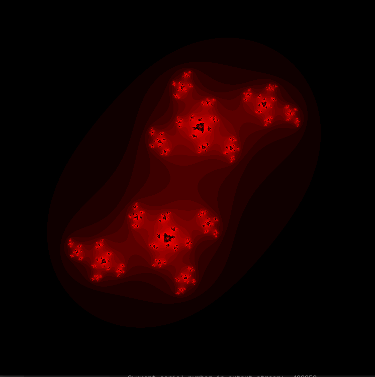
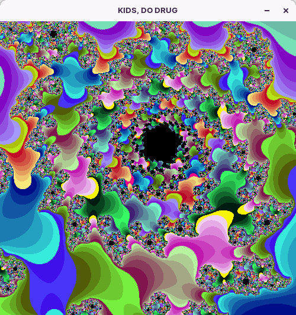
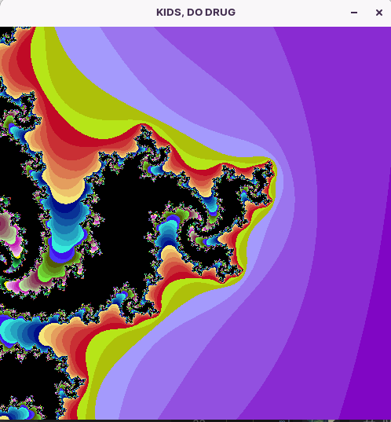

# Fract-ol

[](https://github.com/JaeSeoKim/badge42)

This is the fract-ol project of 42 school. (Also the best project at 42)

## How-to-compile
First download the code :
```
git clone git@github.com:lseiller/fractol.git
```
Then go inside and compile :
```
cd fractol
make
```

## How-to-use
Mandelbrot :
```
./fractol Mandelbrot
```
Julia :
```
./fractol Julia (optionial : x and y)
./fractol Julia 0.285 0.01
```
BurningShip :
```
./fractol BurningShip
```
BurningJulia :
```
./fractol BurningJulia (optionial : x and y)
./fractol BurningJulia 0.975 -1.175
```

## Image







## Ressource I use :

[Blog for MinilibX](https://aurelienbrabant.fr/blog)

[Doc for MLX](https://harm-smits.github.io/42docs/libs/minilibx/getting_started.html)

[Arithmetic With Complex Numbers](https://betterexplained.com/articles/intuitive-arithmetic-with-complex-numbers/)

[Mandelbrot equation](https://en.wikipedia.org/wiki/Mandelbrot_set)

[Julia Wiki](https://en.wikipedia.org/wiki/Julia_set)

[BurningShip equation](https://robotmoon.com/burning-ship-fractal)

[Phoenix + Burning](http://usefuljs.net/fractals/docs/mandelvariants.html)

Wolfram

KhanAcademy

BetterExplained
